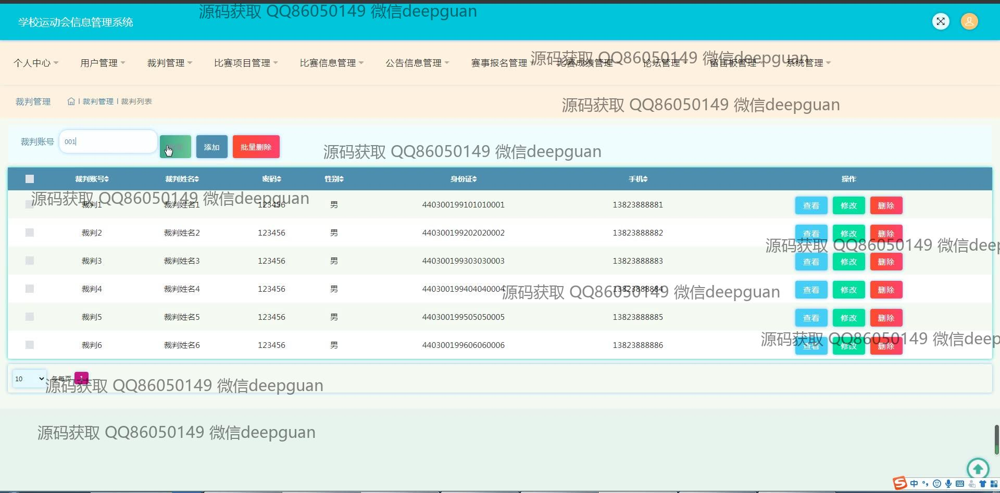

<h1 align="center">学校运动会信息管理系统</h1>

## 简介
学校运动会信息管理系统：角色分为管理员、用户、裁判；功能包括用户管理、比赛项目管理、裁判管理、赛事报名管理、比赛成绩管理、公告信息管理、论坛管理、新闻资讯、留言反馈。    --计算机毕业设计源码；毕设源码；java毕业设计源码

## 联系方式

<h3 align="center">获取完整代码与数据库文件 + 微信：deepguan QQ: 86050149 QQ群: 783742310</h3>

<h3 align="center">可帮忙远程部署 包运行成功！提供远程部署、修改代码、设计文档指导、代码讲解等服务！</h3>

## 功能介绍（完整见运行截图）
管理员：负责系统整体运营，包括比赛信息、裁判、账号、公告、成绩和论坛等模块的管理配置。通过个人中心管理个人信息，支持赛事报名的审核及数据维护。用户权限管理，支持查看、修改与删除功能，维持系统正常运转。提供比赛项目信息发布与修改功能，并支持批量操作如删除，提升赛事管理效率。

用户：可通过注册或登录访问系统，进入个人中心更新个人信息。支持浏览比赛项目信息，进行参赛报名，查看公告及新闻资讯。参与论坛讨论或留言反馈，表达意见与建设性建议。用户可查看比赛详细信息，包含日期、地点及注意事项，并参与赛事评价。提供简洁明了的个人信息管理及赛事参与体验。

## 运行截图

本代码来源于网络,仅供学习参考使用!

